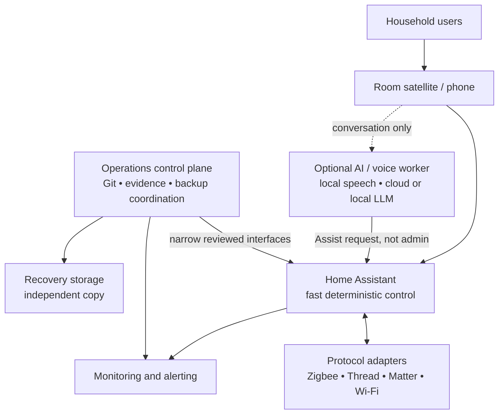

# A role-oriented home platform

Home Assistant is a wonderful place to begin because it turns a collection of
devices into one understandable home model. The platform grows when the same
house also needs recovery, monitoring, repeatable configuration, voice, or
occasional compute. The answer is not to copy a particular topology. Start by
assigning responsibilities, then place each responsibility on the smallest
reliable host that meets the constraints.

## Roles before machines

| Role | Owns | Good first placement | Why it stays separate |
| --- | --- | --- | --- |
| Home control | Home Assistant, integrations, automations, Assist | Appliance or dedicated VM | A predictable control loop should not depend on a build job or a model load. |
| Operations/control plane | Git, inventory, evidence, secrets workflow, backup coordination, narrow AI tools | Small management VM or trusted workstation | It needs access to manage the platform, but should not become a household voice endpoint. |
| Optional services | Dashboards, household applications, small workflow services | Container host or separate VM | Replaceable services should not hide the durable home state. |
| Optional AI/voice worker | Speech-to-text, text-to-speech, local model inference | GPU-capable machine, VM, or cloud API | Hardware and privacy trade-offs vary; voice must not inherit infrastructure authority. |
| Recovery | Hypervisor backups, application exports, off-machine copy | Independent storage and a second recovery location | A backup on the failed host is not a complete recovery plan. |

These roles can be combined on a small machine or separated across several
machines. A Home Assistant appliance may already provide the best answer for a
small installation. A hypervisor becomes useful when isolation, snapshots, or
several independent lifecycles justify its operational cost.

## Example shape



The diagram shows relationships, not a required network layout. Keep the
management path and household path conceptually distinct even when they share
a physical host.

## Data ownership

Give each important thing one owner:

- **Home state** belongs to Home Assistant and its supported backup/export
  mechanism.
- **Desired infrastructure configuration** belongs in version control, with
  secrets referenced but not committed.
- **Observed facts** belong in dated, sanitized reports or generated evidence.
- **Bulk replaceable data** belongs on storage designed for it, and should not
  crowd out recovery-critical configuration.
- **Voice vocabulary** belongs in the home context and Assist configuration,
  with aliases that sound like what a person actually says.

When two systems claim to own the same setting, future automation will drift.
Make the ownership decision explicit before adding another integration.

## Choosing a placement

Ask, in order:

1. Does this need to be available for basic home control?
2. Does it contain durable state or can it be rebuilt?
3. Does it need hardware or latency that other roles cannot share?
4. What is the recovery path if this host dies?
5. Can an agent inspect and verify it through a narrow interface?

Only then decide between appliance, VM, container, host process, or cloud
service. More layers can improve isolation, but every layer adds a recovery
boundary and a fact that must be documented.

## A small installation is valid

For one appliance and a few devices, the role map may collapse to:

```text
Home Assistant appliance
  ├─ integrations + automations + Assist
  ├─ built-in backups
  └─ one external backup destination
```

The principles still apply. The control plane can be a Git repository and an
attended laptop. Add a hypervisor or an AI worker when a concrete requirement,
not fashion, justifies it.

