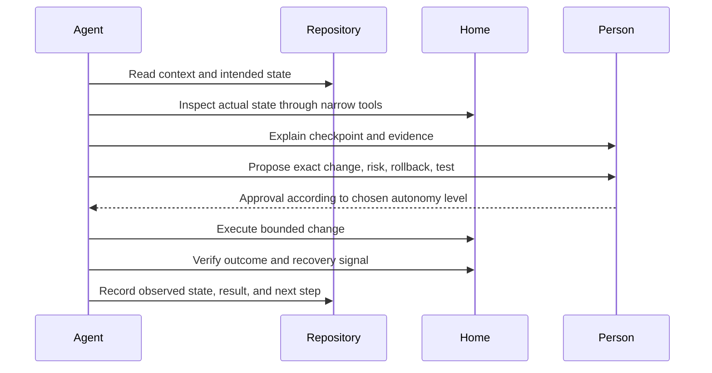

# Source of truth: intent, observation, and evidence

An AI-assisted platform is only as understandable as the context it can read.
The source of truth is not one magical file. It is a small, linked set of
artifacts that distinguishes what the platform should be from what it is right
now.

## Four kinds of knowledge

| Kind | Answers | Examples | Change rate |
| --- | --- | --- | --- |
| Context | What does the household mean? | room names, preferred language, safety boundaries | Low |
| Desired state | What have we chosen? | architecture, versions, ownership, policy | Medium |
| Observed state | What did an inspection find? | package versions, health, capacity, last backup | High |
| Evidence | How do we know? | command output, test result, timestamp, source link | Per check |

Never silently turn an observation into a decision. A machine may currently
have one model installed without that being the intended model. A service may
be healthy today without having a recovery plan.

## A practical repository shape

```text
context/             stable vocabulary and boundaries
desired/             reviewed architecture and policy
inventory/           role map and host capabilities
observed/            dated, sanitized runtime snapshots
runbooks/            small reversible procedures
outcomes/            what changed, why, and how it was verified
decisions/           durable trade-offs with alternatives
handoff.md           exact next checkpoint
```

The names are a suggestion, not a framework. A small home can use three files.
The important property is that a new person or agent can find the answer
without mining chat history.

## The inspect → explain → propose → execute → verify → document loop



The approval step is a policy choice. A trusted operator may allow a low-risk
maintenance class to run unattended. A new user may require approval for every
write. The loop stays the same.

## Make handoffs useful

A good handoff says:

- where the source of truth is;
- what is complete and what is only proposed;
- the last verified observation and its timestamp;
- commands or interfaces used for verification;
- what is risky or still unknown;
- one exact next checkpoint;
- how to recover if the next step fails.

Avoid a diary of every command. Preserve decisions and evidence that reduce
future rediscovery.

## Drift review

At a useful cadence, compare:

```text
desired state  ↔  observed state  ↔  evidence age
```

Classify each difference as intentional, accidental, temporary, or unknown.
Do not “fix” drift automatically until the ownership and recovery path are
clear. A stale document can be more dangerous than an obvious mismatch.

