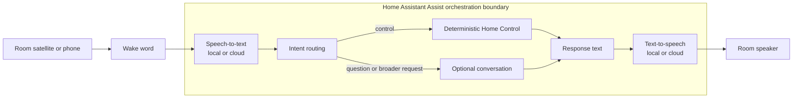

# Voice: fast control first, conversation second

Voice is where a home platform meets the room. It should feel immediate for a
light or temperature request and forgiving when speech recognition is imperfect.
Design the deterministic path first, then add conversation where it helps.

## Conceptual flow



Assist is the orchestration boundary: it runs or coordinates speech-to-text,
routes the recognized intent, sends control intents to deterministic Home
Control or sends broader questions to optional conversation, then routes both
responses through text-to-speech. Every response path ends at the room speaker.
The wake word may run on the satellite before the audio enters Assist.

The language model is optional. A cloud or local LLM should not be in the
critical path for turning off a light when Assist can resolve the intent
directly.

## Local speech

Local speech-to-text and text-to-speech can provide low latency, privacy, and
predictable recurring cost. The trade-offs are CPU/GPU capacity, language
coverage, microphone distance, background noise, wake-word accuracy, and
maintenance. Measure a short representative phrase set rather than assuming
that a model's benchmark transfers to a room.

## Local conversational AI

A local model can be useful when the host has sufficient RAM/VRAM and the
latency is acceptable. Choose by the whole interaction: language, context
length, tool-calling behavior, warm-up time, power, and failure mode. A larger
model is not automatically better at a household command.

## Cloud conversational AI

Cloud reasoning may be simpler or more capable when local hardware is weak or
current knowledge matters. Decide what leaves the home, whether recordings are
retained, and what happens if the provider is unavailable. Use a provider's
current privacy and API documentation; do not infer policy from a model's name.

## Hybrid routing

A practical hybrid often looks like:

```text
local wake word → Assist orchestration → selected STT → intent routing
                     ├─ Home Control → response → selected TTS → room speaker
                     └─ optional conversation → response → selected TTS → room speaker
```

Keep routing explicit. A user should know whether a request is a home-control
intent, a local conversation, or an external request.

## Aliases are part of the interface

Use the words people actually say: a device's room, purpose, and common short
name. Test aliases in every supported language. Avoid ambiguous roomless words
when several devices could match. Preserve the canonical entity name for
automation, and use aliases as a human interface layer.

## A critical boundary

Do not expose SSH, hypervisor, container, Docker, firewall, backup, or
maintenance tools directly to a household voice agent. A voice assistant can
request a reviewed household action through Assist. Infrastructure changes
stay in the operations/control-plane workflow with explicit permissions and a
visible audit trail.

## Voice decision tree

```text
Is this deterministic Home Control?
  ├─ yes → Assist intent; keep it fast and local where practical
  └─ no → Is a local answer good enough and private enough?
          ├─ yes → local conversational model
          └─ no → selected cloud model with explicit data boundary

Both answer paths → selected text-to-speech → room speaker
```
