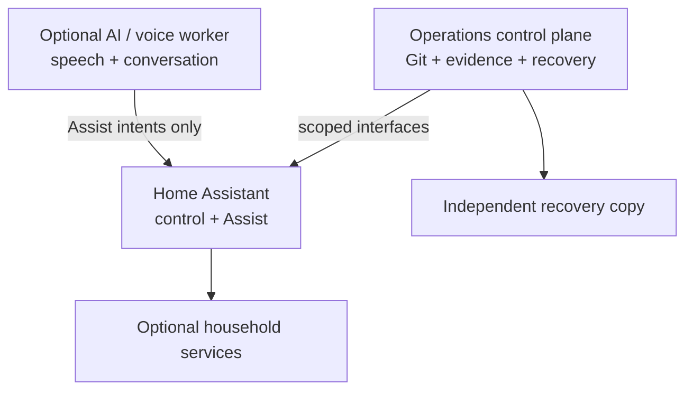
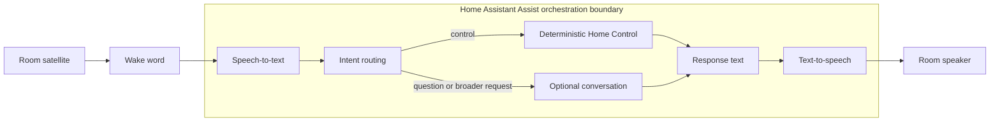

# 1 · Build Your Own Home Platform With AI + Voice

### A practical architecture for Home Assistant, operations, and optional AI

**Source of truth + narrow interfaces + evidence + staged changes + AI assistance**

<!-- Speaker notes: 45 seconds. Welcome the audience and set the promise: this is an approach, not a shopping list. The examples are generic by design. -->

---

# 2 · Home Assistant starts fun

- Add one device
- Give it a room and a name
- Build a dashboard
- Automate a small annoyance
- Tell a friend: “the house just did that”

<!-- Speaker notes: 60 seconds. Invite a show of hands from people who started with one light, sensor, or automation. The emotional hook matters: the project is worth preserving. -->

---

# 3 · Then complexity arrives

```text
devices → rooms → protocols → automations → dashboards
        → services → backups → monitoring → voice → AI
```

The system is no longer “a few automations.” It has ownership, lifecycle, and
recovery questions.

<!-- Speaker notes: 60 seconds. Explain that complexity is not failure; it is a signal that responsibilities now deserve names. -->

---

# 4 · “My smart home became a platform”

You now need to answer:

- What should be true?
- What is true right now?
- Which system owns this setting?
- What can I safely change?
- How do I recover after a bad update?

<!-- Speaker notes: 60 seconds. Let the audience recognize the moment. Ask which question is hardest in their current setup. -->

---

# 5 · What AI changes

An AI operations partner can help to:

- inventory hardware and current state;
- explain trade-offs in plain language;
- draft configuration and documentation;
- run bounded checks;
- compare benchmarks;
- keep a handoff useful.

It does **not** remove the need for boundaries or evidence.

<!-- Speaker notes: 90 seconds. Frame AI as a force multiplier for discovery and maintenance. The next slides explain why “give it root” is not the design. -->

---

# 6 · The central pattern

## Source of truth

Intent, vocabulary, ownership, decisions

## Narrow interfaces

The smallest tool and permission for the checkpoint

## Evidence

Observed state, tests, timestamps, recovery proof

## Staged changes

One understandable checkpoint at a time

## AI assistance

Faster design, build, explanation, and evolution

<!-- Speaker notes: 90 seconds. Read the five pieces as one system. AI becomes safer and more useful when the other four are explicit. -->

---

# 7 · Desired state is not observed state

```text
desired:  Assist controls useful room devices
observed: 17 diagnostic entities are also exposed
evidence:  current entity list + tested phrases
decision:  remove plumbing; preserve human controls
```

Keep these statements separate. Drift becomes visible instead of mysterious.

<!-- Speaker notes: 75 seconds. Use a generic example of a voice exposure audit. Explain that an agent should inspect the live state instead of trusting an old plan. -->

---

# 8 · A role-oriented architecture



Roles may share one machine or occupy separate guests.

<!-- Speaker notes: 90 seconds. Explain roles before machines. A small appliance can collapse all optional roles; a larger host may separate them. -->

---

# 9 · Home Assistant stays appliance-like

Home Assistant owns:

- integrations and protocol adapters;
- entities and areas;
- automations and scenes;
- Assist and deterministic home control.

Keep it fast, recoverable, and useful when every optional AI service is offline.

<!-- Speaker notes: 60 seconds. Stress that “AI-first” does not mean “AI in every control loop.” -->

---

# 10 · Why an operations control plane exists

It owns the work around the home:

- source-of-truth Git repository;
- inventory and dated observations;
- secrets workflow;
- backup coordination and restore tests;
- validation, runbooks, and handoffs.

It is a trusted operator surface, not a household voice surface.

<!-- Speaker notes: 60 seconds. This role pays for itself when the next change needs context, recovery, or repeatability. -->

---

# 11 · How AI connects safely

```text
read-only inspection → proposal → approved scoped action
        ↓                  ↓             ↓
   evidence          risk + rollback   outcome test
```

Examples of narrow boundaries:

- Home Assistant supported API for home behavior
- scoped hypervisor API for ordinary guest operations
- version-controlled files for desired configuration

<!-- Speaker notes: 75 seconds. Contrast a curated interface with a generic root shell. The agent should not need every power to answer every question. -->

---

# 12 · Inspect → explain → propose → execute → verify → document

1. Read repository context
2. Inspect actual state
3. Explain the checkpoint
4. Propose target, risk, recovery, and test
5. Execute within the approval policy
6. Verify the user-facing outcome
7. Record the handoff

<!-- Speaker notes: 90 seconds. This is the operating loop. Pause before “execute”: autonomy is a deliberate policy, not a model default. -->

---

# 13 · Building from an empty machine

Start with questions, not software:

- What must work during a network outage?
- What data is durable?
- What can be rebuilt?
- What is the recovery console?
- What privacy and power constraints matter?

Then choose appliance, host OS, or hypervisor.

<!-- Speaker notes: 60 seconds. The right architecture for a small appliance may be no hypervisor. Complexity should be earned by a requirement. -->

---

# 14 · Let AI inventory hardware

An agent can collect facts such as:

- CPU, RAM, storage, GPU, USB, NICs;
- power, battery/UPS, and thermal limits;
- current operating system and services;
- available recovery paths.

It should report uncertainty and avoid copying identifiers into shared notes.

<!-- Speaker notes: 60 seconds. Hardware inventory is a high-value, low-risk AI task. Show a sanitized table rather than a real machine screenshot. -->

---

# 15 · Let requirements drive architecture

```text
Need deterministic control? → keep it close to Home Assistant
Need isolation?             → consider VM/container boundary
Need GPU/low latency?       → consider optional AI worker
Need only a few devices?    → stop at the appliance
```

Always compare the recovery cost of one more layer.

<!-- Speaker notes: 75 seconds. Explain that architecture is a set of trade-offs, not a badge. The same user may choose differently next year. -->

---

# 16 · Storage: durable versus replaceable

```text
Durable:      configuration, automations, device registry, service DBs
Rebuildable:  Git, Compose/Ansible, dashboards, runbooks
Replaceable:  caches, generated files, temporary data
Bulk:         personal files with their own retention policy
```

Back up what makes the platform itself hard to recreate.

<!-- Speaker notes: 75 seconds. A full disk can be as damaging as a failed disk. Keep replaceable data from crowding out recovery-critical state. -->

---

# 17 · Backups and recovery

A green scheduler is not restore proof.

1. Back up durable state off-host
2. Keep encryption recovery material separate
3. Restore a representative database/configuration in isolation
4. Run integrity checks
5. Record duration, gaps, and next action

Recovery order matters more than tool branding.

<!-- Speaker notes: 90 seconds. Ask the audience when they last restored, not when the job last ran. A five-minute isolated restore is a powerful habit. -->

---

# 18 · Monitoring is evidence

Monitor the layers that answer a question:

- reachable?
- ready?
- fresh?
- enough capacity and thermal headroom?
- latest backup within policy?

Test the monitor with a controlled disposable failure.

<!-- Speaker notes: 60 seconds. A dashboard is for orientation; a dated observation and a tested alert explain what happened. -->

---

# 19 · Device and protocol ownership

Decide who owns each layer:

```text
radio / adapter → integration → entity → automation → voice alias
```

Expose human controls and useful status. Keep firmware, pairing, diagnostics,
internal policy switches, and plumbing out of the household interface by
default.

<!-- Speaker notes: 75 seconds. More entities does not mean more capability for a person. A good exposure list is curated, not maximal. -->

---

# 20 · Managing Home Assistant at scale

- Use areas and natural names
- Keep one owner for each setting
- Preserve supported backups before refactors
- Use aliases for the words people say
- Test English and other household languages
- Keep deterministic control independent of optional AI

The interface is the room, not the integration's debug panel.

<!-- Speaker notes: 60 seconds. This is where source-of-truth vocabulary meets daily usability. Mention that aliases are an API for humans. -->

---

# 21 · Voice architecture



Assist is the orchestration boundary around speech-to-text, intent routing,
deterministic Home Control or optional conversation, and text-to-speech. Both
intent branches return a response to the same speaker.

<!-- Speaker notes: 75 seconds. Walk left to right. Keep the control branch short and predictable; the conversation branch can be richer and slower. -->

---

# 22 · Local speech

### Benefits

- privacy and predictable cost
- low latency when hardware is sufficient
- independence from a cloud outage

### Trade-offs

- compute, power, and maintenance
- language and accent coverage
- room noise, microphone distance, and wake-word quality

Benchmark the room, not just the model card.

<!-- Speaker notes: 75 seconds. STT and TTS can be local even when reasoning is external. Treat speech as an end-to-end product. -->

---

# 23 · Local LLM versus online LLM

| Question | Local model | Cloud model |
| --- | --- | --- |
| Data boundary | stays within chosen environment | crosses a provider boundary |
| Latency | depends on local capacity | depends on network/provider |
| Cost | hardware and power | usage and subscription |
| Maintenance | model/runtime updates | provider handles runtime |
| Capability | constrained by hardware | often broad/current |

There is no universal winner.

<!-- Speaker notes: 75 seconds. Avoid product lists. Ask which axis the audience values for each kind of request. -->

---

# 24 · Why hybrid routing is useful

```text
local wake word → Assist → speech-to-text → intent routing
                                  ├─ Home Control → response → selected TTS → room speaker
                                  └─ optional conversation → response → selected TTS → room speaker
```

The route can depend on intent, privacy, latency, and availability.

<!-- Speaker notes: 60 seconds. Hybrid is not indecision; it is using different systems for different jobs. -->

---

# 25 · Dedicated room satellites

Design for the room:

- microphone distance and background noise;
- wake-word false positives;
- echo cancellation and speaker placement;
- language and pronunciation;
- visible mute/privacy state;
- behavior when the network or model is down.

Commission new hardware in a small, measurable checkpoint.

<!-- Speaker notes: 60 seconds. A satellite is an interface with physical constraints, not merely another network client. -->

---

# 26 · Benchmark instead of guessing

Use a small phrase set:

- short device control
- room-qualified control
- adjustment and status question
- normal conversation
- ambiguous phrase
- each household language

Measure success, clarification, warm/cold latency, power, and failure mode.

<!-- Speaker notes: 75 seconds. Explain why a larger model can still be worse for a short command. Keep samples and transcripts sanitized. -->

---

# 27 · Gaming-PC / on-demand compute ideas

An optional worker can handle enhanced or batch work while core control stays
available:

```text
request → policy → wake → health check → bounded job → evidence → idle shutdown
```

Measure wake latency, warm latency, power, noise, and fallback behavior.

<!-- Speaker notes: 60 seconds. Treat a workstation as an optional capacity pool, not a dependency for turning off the lights. -->

---

# 28 · Household workflows

Use the natural owner:

- Home Assistant: device state and fast automations
- task system: recurring responsibilities
- workflow service: multi-API coordination and approvals
- operations runbook: infrastructure changes

Every workflow needs idempotence, retries, a failure path, and an owner.

<!-- Speaker notes: 60 seconds. The user should always know where to look when a reminder, event, or device action fails. -->

---

# 29 · Where visual automation fits

Visual workflow tools are useful for visible API glue and event-driven
coordination. Keep them:

- downstream of authoritative state;
- pinned and backed up;
- explicit about credentials and retries;
- away from safety-critical latency paths;
- understandable without a single person's memory.

<!-- Speaker notes: 60 seconds. This is a fit discussion, not a product endorsement. A visual canvas is an interface, not automatically a source of truth. -->

---

# 30 · Things that go wrong

- docs drift away from the live system;
- a backup exists but has never been restored;
- a diagnostic entity leaks into the voice interface;
- a model is benchmarked in a lab, not a room;
- one host becomes a hidden single point of failure;
- an agent is given more authority than the checkpoint needs.

The remedy is evidence, ownership, and a smaller next step.

<!-- Speaker notes: 75 seconds. These are patterns, not private incident reports. Ask the audience which one they have seen. -->

---

# 31 · What AI is especially good at

- reading a large repository and finding drift;
- turning requirements into alternatives;
- drafting runbooks, schemas, and diagrams;
- generating repeatable checks;
- comparing benchmark output;
- explaining unfamiliar systems;
- maintaining handoffs and lessons.

It is strongest when the evidence is accessible.

<!-- Speaker notes: 60 seconds. AI lowers the cost of understanding; it does not make unknown facts known. -->

---

# 32 · What still needs human approval

Require a person for:

- destructive actions and data deletion;
- firewall, routing, identity, or remote-access changes;
- backup/encryption policy changes;
- rebooting the only management path;
- new external data sharing;
- exposing new household controls to voice.

The agent prepares the change and the rollback; the person owns the blast radius.

<!-- Speaker notes: 60 seconds. Make this concrete. “Unattended” is a chosen class of low-risk work, not a blank cheque. -->

---

# 33 · The starter repository

A useful starter asks before it prescribes:

- hardware, network, smart-home protocols, and goals;
- services, AI/voice preference, budget, and privacy;
- downtime tolerance and recovery ability;
- desired autonomy and approval boundaries.

It should produce multiple coherent architectures with trade-offs.

<!-- Speaker notes: 60 seconds. Invite attendees to use the questions in their own projects. If an agent can inspect a fact, it should inspect it rather than ask. -->

---

# 34 · Your build path

```text
discover → source of truth → base host → recovery
        → Home Assistant → repeatable operations
        → monitoring → voice/AI → optional workflows
```

Stop at the smallest checkpoint that solves today's problem. Add complexity
only when it buys a capability you can explain and recover.

<!-- Speaker notes: 60 seconds. This is the practical takeaway. The platform is a journey with safe stopping points, not an all-or-nothing migration. -->

---

# 35 · Close: make the next session cheaper

## A capable AI plus a trustworthy source of truth can help you:

- understand the platform;
- build it in stages;
- test what changed;
- recover when it fails;
- evolve it without losing the plot.

### Keep the sentence:

**source of truth + narrow interfaces + evidence + staged changes + AI assistance**

<!-- Speaker notes: 45 seconds plus questions. Repeat the central sentence, point to the guide and references, and invite questions about trade-offs rather than brands. -->
